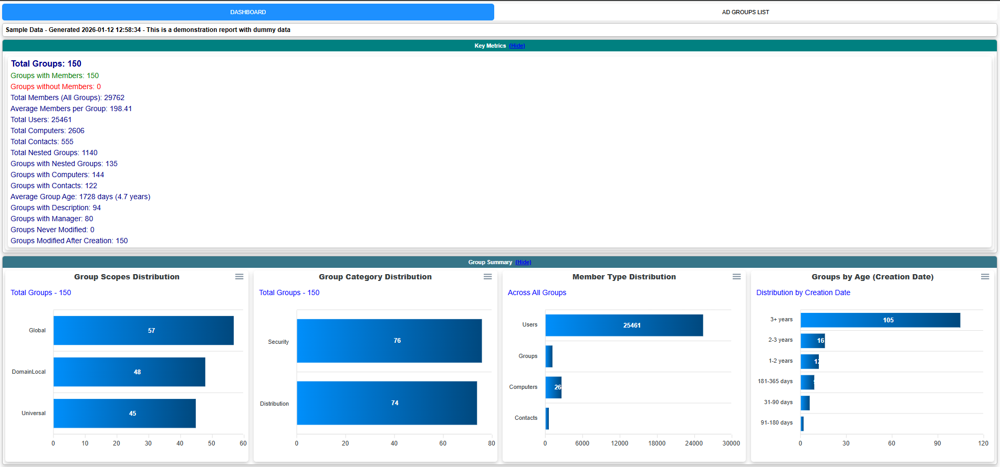
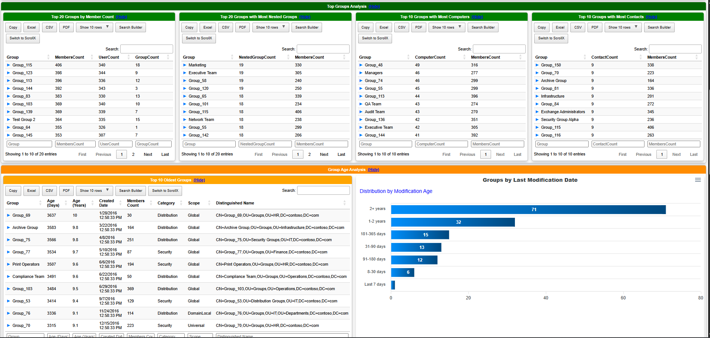
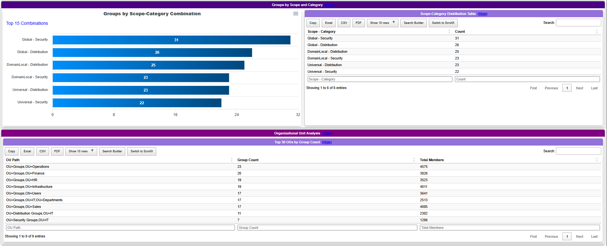
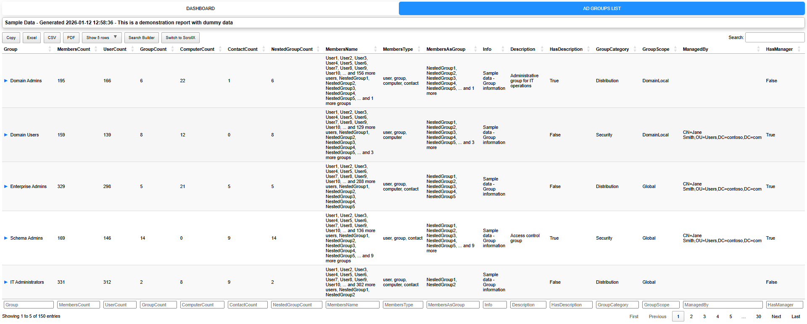

# Get AD GroupMember NoRecursive counts
## Overview

A comprehensive PowerShell script for analyzing Active Directory groups and generating detailed statistics and reports. This script retrieves **direct (non-recursive) members** from AD groups and creates an interactive HTML dashboard with extensive analytics.

**Version:** 2.0  
**Author:** Amol Patil  
**Email:** amolsp777@live.com  
**Created:** 19/OCT/2016  
**Last Modified:** 2026

---

## Features

- ✅ **Non-Recursive Member Retrieval** - Gets only direct members of groups (not nested members)
- ✅ **Parallel Processing** - Supports parallel execution for faster processing (PowerShell 7+) or sequential processing (PowerShell 5.1+)
- ✅ **Comprehensive Statistics** - Generates extensive analytics and metrics
- ✅ **Interactive HTML Dashboard** - Beautiful, filterable HTML reports with charts and tables
- ✅ **CSV Export** - Exports all data to CSV for further analysis
- ✅ **Domain Agnostic** - Works with any Active Directory domain
- ✅ **Error Handling** - Robust error handling with retry logic
- ✅ **Progress Tracking** - Real-time progress indicators
- ✅ **Configurable** - Multiple parameters for customization

---

## Sample Dashboard Generator

A companion script `Generate-SampleDashboard.ps1` is included to create an HTML dashboard with sample/dummy data. This is useful for:

- **Demonstration purposes** - Show stakeholders what the output looks like
- **Testing** - Test the dashboard without running the full script
- **Training** - Use as a training example
- **Documentation** - Include in documentation or presentations

### Generate Sample Dashboard

```powershell
# Generate sample dashboard with default 150 groups
.\Generate-SampleDashboard.ps1

# Generate with custom number of groups
.\Generate-SampleDashboard.ps1 -NumberOfGroups 200

# Specify output path
.\Generate-SampleDashboard.ps1 -OutputPath "C:\Reports\Sample"
```

**Note:** This script only requires the `PSWriteHTML` module - no Active Directory access needed!

---

## Requirements

### Prerequisites

1. **PowerShell Version:**
   - PowerShell 5.1 or higher (Windows PowerShell)
   - PowerShell 7.0+ recommended for parallel processing

2. **PowerShell Modules:**
   - `ActiveDirectory` module (RSAT-AD-PowerShell)
   - `PSWriteHTML` module

3. **Permissions:**
   - Read access to Active Directory groups
   - Read access to group members
   - Read access to group properties

4. **Operating System:**
   - Windows Server 2008/2012/2016/2019/2022
   - Windows 10/11 (with RSAT tools installed)

### Installation

```powershell
# Install required modules
Install-Module -Name ActiveDirectory -Force
Install-Module -Name PSWriteHTML -Force

# Import modules
Import-Module ActiveDirectory
Import-Module PSWriteHTML
```

---

## Parameters

| Parameter | Type | Mandatory | Default | Description |
|-----------|------|-----------|---------|-------------|
| `GroupNames` | String[] | No | None | Specific group names to process |
| `SearchBase` | String | No | None | LDAP path to search for groups (e.g., "OU=Groups,DC=domain,DC=com") |
| `MaxGroups` | Int | No | None | Maximum number of groups to process |
| `OutputPath` | String | No | Script directory | Path where CSV and HTML files will be saved |
| `WebCopyPath` | String | No | None | Optional path to copy HTML dashboard (e.g., web server location) |
| `FileRetentionDays` | Int | No | 60 | Number of days to keep old CSV/HTML files before cleanup |
| `FilterOUs` | String[] | No | @("OU=TEAMS", "OU=SERVICES") | OUs to filter for "No Members" groups analysis |
| `ThrottleLimit` | Int | No | 10 | Number of parallel threads (PowerShell 7+) or runspaces (PowerShell 5.1) |
| `UseSequential` | Switch | No | False | Force sequential processing instead of parallel |

---

## Usage Examples

### Basic Usage (Process All Groups)

```powershell
.\Get-ADGroupMember_NoRecursive_count.ps1
```

### Process Specific Groups

```powershell
.\Get-ADGroupMember_NoRecursive_count.ps1 -GroupNames "Domain Admins", "Domain Users", "Enterprise Admins"
```

### Process Groups from Specific OU

```powershell
.\Get-ADGroupMember_NoRecursive_count.ps1 -SearchBase "OU=Security Groups,DC=contoso,DC=com"
```

### Limit Number of Groups

```powershell
.\Get-ADGroupMember_NoRecursive_count.ps1 -MaxGroups 100
```

### Custom Output Path

```powershell
.\Get-ADGroupMember_NoRecursive_count.ps1 -OutputPath "C:\Reports\ADGroups"
```

### Copy Dashboard to Web Server

```powershell
.\Get-ADGroupMember_NoRecursive_count.ps1 -WebCopyPath "\\webserver\wwwroot\ADGroups\Home.html"
```

### Custom OU Filters

```powershell
.\Get-ADGroupMember_NoRecursive_count.ps1 -FilterOUs @("OU=Departments", "OU=Security Groups")
```

### Sequential Processing (If Parallel Has Issues)

```powershell
.\Get-ADGroupMember_NoRecursive_count.ps1 -UseSequential
```

### Adjust Parallel Processing Throttle

```powershell
.\Get-ADGroupMember_NoRecursive_count.ps1 -ThrottleLimit 20
```

### Combined Example

```powershell
.\Get-ADGroupMember_NoRecursive_count.ps1 `
    -SearchBase "OU=Groups,DC=contoso,DC=com" `
    -MaxGroups 500 `
    -OutputPath "C:\Reports" `
    -FileRetentionDays 30 `
    -ThrottleLimit 15 `
    -FilterOUs @("OU=Security", "OU=Distribution")
```

---

## Output Files

### CSV File
- **Filename:** `GroupMembers_List_<Date>.csv`
- **Location:** Specified `OutputPath` or script directory
- **Contains:** Complete group data with all member information

### HTML Dashboard
- **Filename:** `AD_Groups_List_<Date>.html`
- **Location:** Specified `OutputPath` or script directory
- **Features:**
  - Interactive tables with filtering and pagination
  - Charts and visualizations
  - Multiple dashboard sections
  - Exportable data

---

## Dashboard Sections

### 1. Key Metrics
- Total groups count
- Groups with/without members
- Total members across all groups
- Average members per group
- Total users, computers, contacts
- Groups with nested groups
- Average group age
- Groups with description/manager
- Groups never modified

### 2. Group Summary
- **Charts:**
  - Group Scopes Distribution
  - Group Category Distribution
  - Member Type Distribution
  - Groups by Age (Creation Date)

### 3. Top Groups Analysis
- Top 20 groups by member count
- Top 20 groups with most nested groups
- Top 10 groups with most computers
- Top 10 groups with most contacts

### 4. Group Age Analysis
- Top 10 oldest groups (with age in days/years)
- Groups by last modification date (chart)

### 5. Groups by Scope and Category
- Chart showing scope-category combinations
- Detailed distribution table

### 6. Organizational Unit Analysis
- Top 30 OUs by group count
- Total members per OU

### 7. Members Summary
- Groups without members (filtered by OU)
- Includes Group Category and Group Scope columns

### 8. Recent Activity
- Groups modified in last 30 days
- Groups created in last 90 days

### 9. Governance & Compliance
- Groups without description (Top 50)
- Groups without manager (Top 50)
- Groups not modified in last year (Top 30)

### 10. AD Groups List
- Complete list of all processed groups
- Filterable and searchable table
- All group properties and statistics

---

## Sample Screenshots

The following screenshots provide visual examples of the dashboard output:

### Dashboard Overview


*Key Metrics and Group Summary Charts*


*Top Groups Analysis and Group Age Analysis*


*Groups by Scope/Category and Organizational Unit Analysis*


*Members Summary and Recent Activity*

### AD Groups List


*Complete filterable list of all processed groups with all properties*

---

## CSV Output Columns

| Column | Description |
|--------|-------------|
| Group | Group name |
| MembersCount | Total direct members count |
| UserCount | Number of user members |
| GroupCount | Number of group members (nested groups) |
| ComputerCount | Number of computer members |
| ContactCount | Number of contact members |
| NestedGroupCount | Number of nested groups |
| MembersName | Comma-separated list of member names |
| MembersType | Types of members (user, group, computer, contact) |
| MembersAsGroup | Names of nested groups |
| Info | Group info field |
| Description | Group description |
| HasDescription | Boolean indicating if description exists |
| GroupCategory | Security or Distribution |
| GroupScope | DomainLocal, Global, or Universal |
| ManagedBy | DN of the manager |
| HasManager | Boolean indicating if manager exists |
| DistinguishedName | Full DN of the group |
| OUPath | Extracted OU path |
| whenCreated | Creation timestamp |
| whenChanged | Last modification timestamp |
| DaysSinceCreated | Age in days |
| DaysSinceModified | Days since last modification |

---

## Performance Considerations

### Parallel Processing (PowerShell 7+)
- **Default:** 10 concurrent threads
- **Adjustable:** Use `-ThrottleLimit` parameter
- **Recommended:** 10-20 for most environments
- **Higher values:** May cause AD server load issues

### Sequential Processing
- **Use when:** Parallel processing fails or causes issues
- **Use when:** AD server cannot handle concurrent requests
- **Slower:** But more reliable for large environments

### Processing Time
- **Small environments (< 100 groups):** 1-2 minutes
- **Medium environments (100-1000 groups):** 5-15 minutes
- **Large environments (> 1000 groups):** 15-60+ minutes

---

## Error Handling

The script includes comprehensive error handling:

- **Module Validation:** Checks for required modules before execution
- **Group Processing Errors:** Continues processing even if individual groups fail
- **Error Records:** Failed groups are recorded with error messages
- **Timeout Protection:** Parallel processing has 1-hour timeout
- **Graceful Degradation:** Falls back to sequential if parallel fails

---

## Troubleshooting

### Issue: "Required module not installed"

**Solution:**
```powershell
Install-Module -Name ActiveDirectory -Force
Install-Module -Name PSWriteHTML -Force
```

### Issue: "Access Denied" errors

**Solution:**
- Ensure account has read permissions to AD groups
- Run PowerShell as Administrator or with appropriate AD permissions
- Check if account is member of "Domain Users" or has delegated permissions

### Issue: Parallel processing hangs

**Solution:**
```powershell
# Use sequential processing
.\Get-ADGroupMember_NoRecursive_count.ps1 -UseSequential
```

### Issue: Script is too slow

**Solution:**
- Use `-MaxGroups` to limit processing
- Use `-SearchBase` to process specific OUs
- Increase `-ThrottleLimit` (if AD server can handle it)
- Use PowerShell 7+ for better parallel performance

### Issue: "Cannot convert value 'ERROR' to type 'System.Int32'"

**Solution:**
- This has been fixed in version 2.0
- Ensure you're using the latest version of the script

### Issue: Recursive members appearing

**Solution:**
- The script uses `Get-ADGroup -Properties Members` which returns only direct members
- If you see recursive members, ensure you're using the latest version
- Check that the script is using the Members property, not Get-ADGroupMember

---

## Domain Compatibility

✅ **This script is domain-agnostic and works with any Active Directory domain.**

The script:
- Automatically detects the current domain
- Uses relative paths and distinguished names
- No hardcoded domain references
- Works with single-domain and multi-domain forests
- Compatible with any OU structure

### Customization for Your Domain

The only parameter that might need adjustment is `FilterOUs`:

```powershell
# Example for Contoso domain
.\Get-ADGroupMember_NoRecursive_count.ps1 -FilterOUs @("OU=Security Groups", "OU=Distribution Groups")

# Example for Fabrikam domain  
.\Get-ADGroupMember_NoRecursive_count.ps1 -FilterOUs @("OU=Departments", "OU=Resources")
```

---

## Best Practices

1. **Test First:** Run with `-MaxGroups 10` to test before full execution
2. **Schedule Regular Runs:** Use Task Scheduler for automated reports
3. **Monitor Performance:** Watch AD server performance during parallel processing
4. **Review Output:** Check CSV and HTML outputs for accuracy
5. **Archive Reports:** Keep historical reports for trend analysis
6. **Use SearchBase:** Limit scope to relevant OUs for faster execution
7. **Adjust ThrottleLimit:** Start with default (10) and adjust based on performance

---

## Scheduled Task Example

```powershell
# Create scheduled task to run weekly
$action = New-ScheduledTaskAction -Execute "PowerShell.exe" `
    -Argument "-File `"C:\Scripts\Get-ADGroupMember_NoRecursive_count.ps1`" -OutputPath `"C:\Reports\ADGroups`""

$trigger = New-ScheduledTaskTrigger -Weekly -DaysOfWeek Sunday -At 2am

Register-ScheduledTask -TaskName "AD Groups Report" `
    -Action $action `
    -Trigger $trigger `
    -Description "Weekly AD Groups Analysis Report" `
    -User "DOMAIN\ServiceAccount" `
    -RunLevel Highest
```

---

## Version History

### Version 2.0 (Current)
- ✅ Fixed recursive member retrieval issue
- ✅ Added parallel processing support
- ✅ Enhanced error handling
- ✅ Added comprehensive statistics
- ✅ Added Top 10 Oldest Groups
- ✅ Added Group Type columns to Members Summary
- ✅ Improved dashboard with more charts
- ✅ Domain-agnostic implementation
- ✅ Performance optimizations

### Version 1.0 (Original)
- Basic group member retrieval
- CSV export
- Simple HTML dashboard

---

## Support

For issues, questions, or contributions:
- **Email:** amolsp777@live.com
- **Script Location:** Check script header for current version

---

## License

This script is provided as-is for use in Active Directory environments. Modify as needed for your organization's requirements.

---

## Disclaimer

This script is designed for Active Directory analysis and reporting. Always test in a non-production environment first. The authors are not responsible for any issues arising from the use of this script.

---

## Additional Notes

- The script processes groups **non-recursively** - it only shows direct members
- Large groups (like Domain Users) will show all direct members in the CSV
- The HTML dashboard is optimized for viewing in modern browsers
- CSV files are encoded in UTF-8 for international character support
- Old files are automatically cleaned up based on `FileRetentionDays` parameter

---

**Last Updated:** January 2026  
**Script Version:** 2.0

