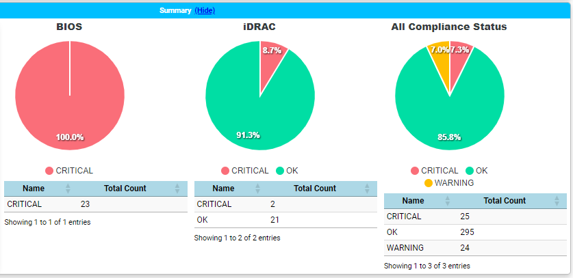

# Dell Firmware Report Script

This script is designed to collect firmware information from Dell OpenManage Enterprise (OME) servers and generate a comprehensive HTML report for analysis. It utilizes PowerShell modules `DellOpenManage` and `PSWriteHTML` for data collection and report generation respectively.

## Prerequisites

- Dell OpenManage Enterprise installed and accessible.
- PowerShell modules `DellOpenManage` and `PSWriteHTML` installed.

## Usage

1. Import the required PowerShell modules.
2. Connect to the OME server using appropriate credentials.
3. Collect firmware information using `Get-OMEFirmwareBaseline` and `Get-OMEFirmwareCompliance`.
4. Filter the firmware data based on specific criteria.
5. Generate HTML report using `PSWriteHTML` module.
6. Save the generated HTML report to a desired location.

## Script Overview

The script performs the following tasks:

1. Connects to the OME server.
2. Collects firmware information for all devices.
3. Filters the firmware data based on BIOS and iDRAC components.
4. Groups the data and calculates total counts for each group.
5. Generates HTML report with the following sections:
   - Total Devices Summary
   - Firmware Compliance Status Charts (BIOS, iDRAC, and All Components)
   - Critical Firmware Information (BIOS and iDRAC)
   - All Device Compliance Summary

## Script Files

- `DellFirmware_Report.ps1`: Main PowerShell script.
- `DellFirmware_Report.html`: Generated HTML report.

## Instructions

1. Ensure Dell OpenManage Enterprise is installed and accessible.
2. Install required PowerShell modules (`DellOpenManage` and `PSWriteHTML`).
3. Modify script parameters such as server name, credentials, and file paths as per your environment.
4. Run the script using PowerShell.
5. Access the generated HTML report (`DellFirmware_Report.html`) for firmware analysis.

## Notes

- Ensure appropriate permissions are set to access Dell OpenManage Enterprise.
- Customize HTML report styling or content as per your requirements.
- Regularly update firmware and review compliance status for optimal server performance and security.

### Sample Output
